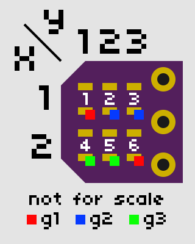

# Charles Jr.

A tiny PCB (0.25x0.25 inches), which charlieplexes (hence the name) 6 LEDs on 3 pins.

It was created because that size happens to be OSHPark's lower size limit—it costs 30¢ for 3 (without components)

It requires 3 resistors and 6 LEDs, both in 0603 format. It also uses a 3-pin header.

To calculate the value of the resistors, use (Vcc - Vf) / (If * 2)

So, for example, a LED that requires 20mA (0.02A) and has a forward voltage of 3v using a power supply with 5v needs:

    (5v - 3v) / (0.02A * 2)
    = 50Ω

The *2 in there is not usually used when calculating resistor values for LEDs. However, it is used here because charlieplexing requires 2 resistors—in series—for LEDs when it's wired the way it is here.  
Thus, for the LED and power supply in the example above, you would usually use a 100Ω resistor while this circuit would use 50Ω resistors.

Enjoy!

## LED groups, x/y values to control them:

